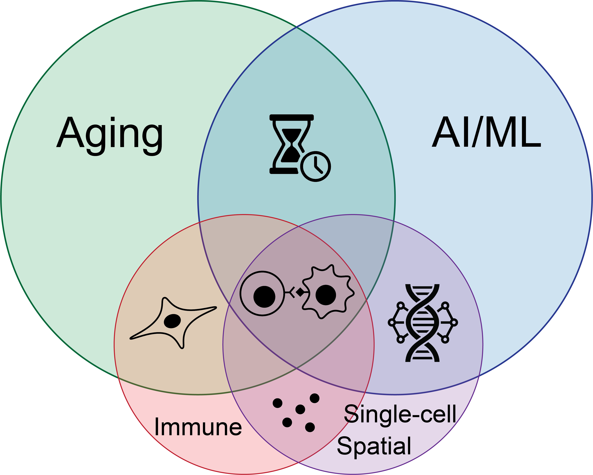

---
---

# Modeling aging and multi-scale biology

We develop new computational and machine learning models to study complex biology across multiple scales with applications in aging, rejuvenation, and immune interactions. We leverage experimental approaches to improve and test our models.







Aging is the greatest risk factor for a broad range of chronic diseases. We have a long-standing interest in understanding the complex biology of aging from the level of the fundamental biological unit (the cell) to the level of the whole system (the organism). Such an understanding can be leveraged to discover and engineer interventions for broadly improving human health and staving off disease. To that end, we develop computational and machine learning tools to (1) measure biological aging from cell to organism, (2) predict and simulate the effects of interventions, including genetic perturbations, on cells and tissues, and (3) design new interventions against aging and optimize their parameters for improved efficacy. We integrate computational frameworks for model building with experimental approaches for biological data generation and model validation.

  



## Research Areas



We are interested in the biological underpinnings of aging. We integrate theoretical, computational (including AI/ML), and experimental approaches to model and understand aging systems and how they respond to different perturbations. These include several projects that extend the framework of "aging clocks" to track aging across multiple biological scales. We use that understanding to inform the rational discovery and design of "rejuvenation" interventions to slow or reverse aspects of age-related decline.







We seek to build new artificial intelligence and machine learning (AI/ML) models for biological and biomedical applications, with a particular focus on leveraging large-scale spatial and single-cell omics data. We are further interested in designing downstream ecosystems that lower the barrier for utilizing AI/ML tools in experimental workflows and expand the application areas for large AI/ML models. We also develop more traditional computational and statistical methods that enable the analysis of high-dimensional datasets (i.e. datasets with a lot of measurements) such as single-cell and spatial transcriptomics.







Our interests extend beyond characterizing the biology within a cell to how multiple cells interact within a tissue, how that tissue functions within an organ, and how changes at the cellular level manifest at the systems level. In particular, we are interested in understanding cellular interactions in the context of immune aging and neuroimmune functions and developing computational models to predict the evolution of these interactions subject to various experimental perturbations.




